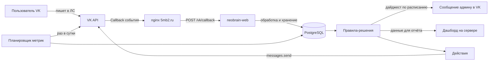
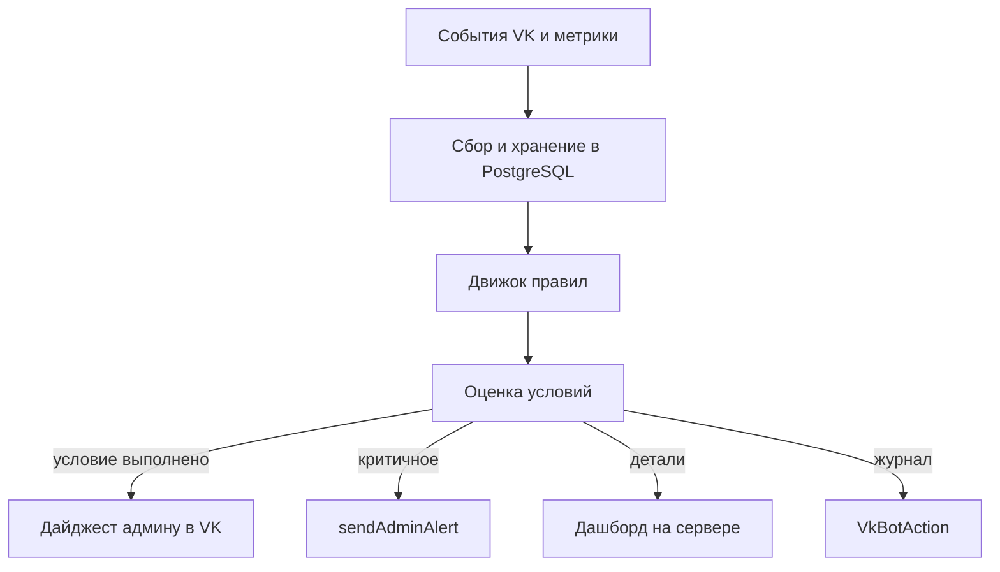

# VK Autopilot — «сообщество как источник данных + автономные решения»

> Цель: превратить VK-сообщество «5MB2 Digital» (id=228742910) из «площадки,
> которую ведём руками» в **управляемый источник данных**, на основе которых
> система сама делает выводы и принимает решения. Анализ и формулировка выводов
> проходят через **DeepSeek**. Результат читается в двух местах: дайджест в VK
> (по расписанию) + дашборд на сервере (детали).
>
> Статус: **проект (architect)** — план согласован, ключевые решения приняты.

## 1. Проблема и принципы

**Проблема.** Панель VK решает «поверхностные» задачи (автоответчик, рассылки,
приветствия) — но не даёт аналитики и автономных решений. Чтобы «на основе
данных делать выводы и решения автоматически», нужен свой сервер.

**Границы (решения пользователя):**
- Не дублируем уведомления VK — VK и так шлёт свои алерты. Ценность сервера —
  в аналитике и выводах, которых VK дать не может.
- Автопостинг откладываем: риск ошибок высокий (текст + новости + публикация).
  Идея остаётся обязательной, но реализуется аккуратно, отдельным этапом.
- Результат анализа читаем: **в VK** (ежедневный дайджест-резюме) **и на сервере**
  (дашборд с метриками, трендами, правилами, журналом действий).

**Что уже есть (не строим с нуля):**
- Сервер `my-vps` (80.78.248.195): **neobrain-web** (Node/Express + Prisma +
  PostgreSQL + Redis) обслуживает 5mb2.ru и neobrain.site.
- **VK-мост**: `/opt/ai-helper/neobrain/services/web/src/vk.js` → `sendAdminAlert`
  (messages.send админу), подключён в `src/notify.js`. Токены VK уже в env сервера.
- Cron: watchdog (2 мин), VK-алерты (5 мин), бэкапы (03:00).
- Локально: `scripts/vk-bot.mjs` (LongPoll-бот, протестирован), `scripts/vk-community.mjs`
  (оформление: посты/аватар/обложка/описание), ключи в `.env.vk`.

**Принципы:**
1. Панель VK используем там, где она справляется (автоответчик, рассылки) — не дублируем.
2. На сервере собираем только то, что даёт ценность: события, метрики, тренды, выводы.
3. Решения — **правила с конфигом**, каждое действие журналируется (аудит).
4. Безопасный старт: Фаза 0 = проверка правил VK; Фаза 1 = сбор данных + дайджест +
   дашборд; Фаза 2 = аналитика и решения-подсказки (без авто-публикаций);
   Фаза 3 (позже) = аккуратный автопостинг по правилам.

## 2. Архитектура

### 2.1. Общая схема



### 2.2. Приём событий: Callback API (РЕШЕНО)

- VK шлёт POST-события на публичный HTTPS `https://5mb2.ru/vk/callback`
  (домен и nginx уже есть).
- Роут `/vk/callback` в neobrain-web:
  - `type=confirmation` → вернуть строку подтверждения из настроек Callback;
  - события `message_new`, `group_join`, `group_leave`, `wall_post_new` → записать
    в БД и прогнать через движок правил.
- Callback-сервер добавляется в сообщество через API: `groups.addCallbackServer`
  (URL, secret, типы событий) — сервисный ключ это умеет (проверено
  `groups.getCallbackServers` ✅).
- LongPoll-бот (`scripts/vk-bot.mjs`) остаётся **локальным инструментом/фолбэком**.

### 2.3. Метрики по расписанию

Ежедневный job (в контейнере neobrain-web или cron):
- `groups.getById` → подписчики, онлайн;
- `groups.getMembers` → счётчики участников;
- `messages.getConversations` → активные диалоги;
- вычисляем дельты за 7/30 дней.

Снимки — в PostgreSQL (таблица `VkMetricSnapshot`).

### 2.4. Модель данных (PostgreSQL, Prisma — новые модели)

| Модель | Назначение | Ключевые поля |
|---|---|---|
| `VkEvent` | сырые события из Callback | type, peerId, fromId, payload, ts |
| `VkMetricSnapshot` | дневной снимок метрик | date, subscribers, conversations, online, delta7, delta30 |
| `VkBotRule` | конфиг правил | name, metric, condition, threshold, action, enabled |
| `VkBotAction` | журнал выполненных действий | ruleId, action, params, result, ts |
| `VkDigest` | отправленные дайджесты | date, summary, detailsRef, ts |

### 2.5. Движок правил (решения) + DeepSeek-анализ

Оценка по расписанию (ежедневно) и/или по событию:

```
события/метрики → контекст → DeepSeek (анализ и выводы) → рекомендации
```

Поток работы:
1. Сбор: события из Callback (`VkEvent`) + дневные снимки (`VkMetricSnapshot`).
2. Контекст: правила задают, что мониторить и пороги (`VkBotRule`).
3. **Анализ: DeepSeek** получает контекст (метрики, тренды, дельты 7/30, события)
   и возвращает выводы и рекомендации на естественном языке.
4. Действие: выводы попадают в дайджест VK и на дашборд; критичные — `sendAdminAlert`.
5. Журнал: каждое действие пишется в `VkBotAction` (аудит, можно вернуть/откатить).

Примеры правил (Фаза 2 — решения-подсказки, без авто-публикаций):
- `subscribers.delta7 < -N` → DeepSeek анализирует возможные причины → пункт в дайджест.
- `conversations > M за день` → DeepSeek обобщает темы обращений → «добавить FAQ/пост».
- `group_join` → записать событие (без проактивного ЛС — риск блокировки VK).
- `время ответа > порога` → DeepSeek выделяет неотвеченные → пункт в дайджест.

Действия (все через существующие механизмы):
- `sendAdminAlert` (уже есть в `src/vk.js`) — для критичных событий (не дубль уведомлений VK);
- `messages.send` — **только дайджест админу по расписанию** (текст готовит DeepSeek);
- `wall.post` + картинка — **отложено (Фаза 3)**, до этого — только предложение в дайджест.

### 2.6. Схема работы движка



## 3. Этапы

### Фаза 0 — Правила VK и подготовка
1. Проверка соответствия правилам VK (см. раздел 4): автоответчик/рассылки — панель VK;
   `wall.post` в своё сообщество — разрешён; **проактивные ЛС новым подписчикам —
   не делаем** (VK ограничивает), только ответы на входящие.
2. Настроить Callback-сервер на сообществе (`groups.addCallbackServer`).

### Фаза 1 — Сбор данных и отображение (безопасно)
3. Роут `/vk/callback` + модели `VkEvent`, `VkMetricSnapshot`.
4. Job ежедневных метрик (подписчики, диалоги, дельты 7/30).
5. Дайджест в VK по расписанию (ежедневный итог: метрики, тренды, выводы).
6. Дашборд на сервере: метрики, тренды, журнал событий/действий.

### Фаза 2 — Аналитика и решения-подсказки (DeepSeek)
7. Движок правил + модели `VkBotRule`, `VkBotAction`, `VkDigest`.
8. **DeepSeek-анализ**: контекст (метрики/тренды/события) → выводы и рекомендации.
9. Выводы DeepSeek попадают в дайджест VK и на дашборд (решения-подсказки, человек публикует).

### Фаза 3 — Аккуратный автопостинг (позже, по согласованию)
10. Авто-посты по правилам: сначала черновики/превью админу, потом публикация.
11. Авто-ответы бота (перенос логики из `vk-bot.mjs` на сервер, только на входящие).
12. Журнал действий и откат. Идея обязательная, но реализуем только когда всё отлажено.

### Место интеграции (РЕШЕНО: Вариант A)
- **Вариант A**: модуль внутри neobrain-web (новый роут `/vk/callback` + сервисы +
  Prisma-модели). Единый стек, БД, деплой.
- **DeepSeek**: вызывается через существующий API-клиент neobrain (уже используется
  в системе) — отдельный сервис для анализа данных VK не нужен.

## 4. Правила VK и риски (проверка перед автономными действиями)

> Обязательный чек-лист перед включением любого автономного действия (Фаза 2+).

- **Автоответчик и рассылки** — официальная функция панели VK (не нарушает правила,
  если не спам).
- **`wall.post` в своё сообщество** — разрешено сервисным токеном группы; ограничения
  по частоте/лимитам API. Контент должен соответствовать правилам VK и тематике
  сообщества (без запрещённого контента).
- **Проактивные ЛС** (сообщение пользователю, который сам не писал сообществу) —
  VK ограничивает: массовые рассылки в ЛС могут вести к ограничениям. Поэтому
  авто-ответы — **только на входящие** сообщения.
- **Лимиты API** — `messages.send`, `wall.post`, `groups.getMembers` имеют rate-limit
  (ошибка 6) — учитываем ретраи и паузы (уже реализовано в `vk-bot.mjs`).
- **Секреты** — service/access токены VK на сервере уже в env; не логировать токены.
- **DeepSeek** — в контекст анализа отправлять **только агрегированные метрики и
  обезличенные данные** (без персональных данных пользователей); выводы могут
  содержать только обобщения.
- **Проверка на реальных событиях** — каждый автономный шаг сначала в тестовом
  режиме (лог вместо действия), потом включаем.

## 5. Открытые вопросы → РЕШЕНО

1. **Callback или LongPoll** на сервере? → **Callback API** (push, без долгоживущего
   процесса); LongPoll остаётся локальным фолбэком.
2. **Место интеграции**? → **Вариант A**: модуль в neobrain-web (единый стек/БД/деплой).
3. **Уровень автономности Фазы 2**? → Не дублируем уведомления VK; автопостинг
   отложен (Фаза 3); Фаза 2 = аналитика + решения-подсказки (дайджест в VK + дашборд).
4. **Дашборд**? → **Да**: дайджест в VK по расписанию + дашборд на сервере для деталей.
