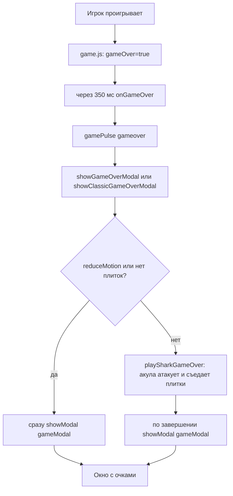

# Фича «Акула» — дизайн-план

## Цель

Добавить драматичную акулу в двух проявлениях:

- **Часть A (фоновая акула):** реалистичная (не эмодзи) акула, которая невзрачно и
  изредка проплывает на фоне в **каждой** из 7 тем (dark/light/autumn/forest/sunset/abyss/sakura).
- **Часть B (атака при проигрыше):** когда игрок проигрывает, акула быстро подплывает,
  «съедает» плитки игрового поля, и только потом появляется окно с очками.

## Ключевые архитектурные факты (проверено)

### Слои (z-index) в [`css/styles.css`](d:/Рабочая/pirat/css/styles.css)
| Слой | z-index | Назначение |
|------|---------|-----------|
| `.atmosphere-layer` (canvas) | 0 | фон «живого океана», за всем UI |
| `.container` (игровой UI, доска) | 2 | доска и элементы |
| `.autumn-layer` (canvas) | 60 | осенние листья поверх UI |
| `.modal-overlay` | ~9000 | модалки |
| `.confetti-layer` | 10000 | конфетти |
| `.loading-screen` | 20000 | загрузка |

Вывод:
- **Часть A** рисуется в canvas-атмосфере (z-index 0) — за доской, «на фоне».
- **Часть B** (поедание DOM-плиток) должна идти **поверх доски** (плитки z-index 1,
  существующая акула-охотник `.shark` z-index 3), но **под модалкой** (9000).
  Подходящий слой — новый fixed-оверлей с z-index между 60 и 9000 (например 5000),
  либо DOM-манипуляции с плитками внутри `.board`.

### Поток game-over
- [`game.js`](d:/Рабочая/pirat/js/game.js) строки 308-312: `this.gameOver = true;`
  затем `setTimeout(() => this.onGameOver(this.score), 350)`.
- В [`main.js`](d:/Рабочая/pirat/js/main.js) несколько обработчиков `onGameOver`
  (depth ~2212, classic ~2338, puzzle ~2862, tournament ~3001, duel ~3188,
  challenge ~3408, weekly ~3576). Каждый вызывает `gamePulse('gameover')`, затем
  `showGameOverModal(score)` (или `showClassicGameOverModal(score)` для classic).
  Обе функции-модалки заканчиваются вызовом `showModal(gameModal)`.
- `gamePulse(kind)` (main.js ~1125) → `atmospherePulse(kind)` → `ocean.setPulse(kind)`.

### Доска — DOM
- `.board` — CSS-grid; `.tile` — абсолютно позиционированные дети (z-index 1),
  позиционируются через CSS-переменные `--tx`/`--ty` и `transform: translate(...)`.
- Геометрия считается в `_layout()` / `_posForIndex(i)` в game.js.
- Существующая акула-охотник `.shark` (🦈) — z-index 3, позиционируется так же.

### reduce-motion
- `body.reduce-motion .atmosphere-layer { display: none; }` (styles.css:2222).
- `OceanAtmosphere` создаётся с `{ reduceMotion }`; `startAtmosphere()`/`resumeAtmosphere()`
  возвращаются рано при reduceMotion.
- При reduce-motion **обе части** должны быть отключены/мгновенны (атака пропускается,
  модалка показывается сразу).

---

## Часть A — фоновая акула в атмосфере

### Файл: [`js/atmosphere.js`](d:/Рабочая/pirat/js/atmosphere.js)

1. **Конфиг THEMES** — добавить в каждую тему параметры появления акулы, например:
   ```js
   shark: { alpha: 0.10, scale: 0.9, chance: 0.0009, tint: 'rgba(120,160,190,1)' }
   ```
   - `alpha` — низкая непрозрачность (невзрачно).
   - `chance` — вероятность появления за кадр (редко).
   - `scale` — размер относительно высоты экрана.
   - `tint` — лёгкая подкраска под тему (в abyss — темнее, в light — светлее).
   - В части тем можно `shark: null`, если акула нежелательна, но по ТЗ — во всех.

2. **Конструктор `OceanAtmosphere`** — добавить массив `this.sharks = []`.

3. **`setTheme(theme, size)`** — сбросить `this.sharks = []` (как остальные массивы).

4. **Генератор `makeShark()`** (чистая функция рядом с `makeKelp`/`makeCoral`):
   ```js
   function makeShark(w, h, cfg) {
     const fromLeft = Math.random() < 0.5;
     return {
       x: fromLeft ? -0.2 * w : 1.2 * w,   // старт за экраном
       y: h * (0.15 + Math.random() * 0.5), // средняя глубина
       dir: fromLeft ? 1 : -1,              // направление
       speed: w * (0.05 + Math.random() * 0.06), // px/сек
       scale: cfg.scale * (0.8 + Math.random() * 0.5),
       alpha: cfg.alpha * (0.7 + Math.random() * 0.6),
       phase: Math.random() * Math.PI * 2,  // фаза волны хвоста
       bob: Math.random() * Math.PI * 2,    // фаза вертикального покачивания
       tint: cfg.tint,
       gone: false,
     };
   }
   ```

5. **Спавн в `draw(dt, t)`** — в начале `draw` (или в отдельном методе `stepSharks`):
   - Если `this.sharks.length === 0` и `Math.random() < cfg.chance * dt` — спавнить одну.
   - Двигаем каждую: `x += dir * speed * dt`; лёгкое вертикальное покачивание
     `y + sin(t + bob) * 8`; если вышла за противоположный край — `gone = true`.
   - Ограничение: одновременно максимум 1-2 акулы.

6. **Рендер реалистичной акулы** (не эмодзи) — нарисовать силуэт через `ctx`:
   - Тело: вытянутый эллипс/путь (нос-конус, спина, хвостовой плавник).
   - Спинной плавник (треугольник), хвост (два лопасти), грудной плавник.
   - Рисовать с `globalAlpha = alpha`, заливая `tint` с лёгким градиентом
     (светлее брюхо). Масштабировать по `scale` и отражать по `dir`.
   - Рисовать в слое **после рыб/планктона, но до водного градиента/келпа** —
     чтобы акула была «в толще воды», но не перекрывала передний план.
     В `draw()` вставить блок рендера акул между слоем рыб и слоем пузырей/медуз.

7. **reduce-motion**: canvas-атмосфера и так скрыта (`display:none`), отдельная
   обработка не нужна.

---

## Часть B — атака и поедание поля при проигрыше

### Идея анимации (киношный «укус» с пастью на весь экран)
1. Игрок проигрывает → game.js ставит `gameOver=true`, через 350 мс зовёт `onGameOver`.
2. Вместо мгновенной модалки запускается короткая драматичная «атака»:
   - Акула **быстро выплывает** из-за края экрана (слева/справа/снизу) на оверлее
     **поверх доски**.
   - Она **приближается к камере** (растёт в масштабе) и **раскрывает пасть почти
     на весь экран** — зрительно «наезжает» на доску.
   - Плитки доски по очереди «втягиваются» в раскрытую пасть (уменьшаются и летят
     к центру пасти), доска пустеет.
   - Пасть «захлопывается» (быстрое закрытие челюстей) — кульминация.
   - Лёгкая вспышка/тряска, оверлей скрывается, показывается модалка с очками.

### Реализация

**A. Новый оверлей-элемент** — создаётся из JS в main.js рядом с атмосферой, чтобы не
трогать разметку:
```js
const sharkAttackLayer = document.createElement('div');
sharkAttackLayer.className = 'shark-attack-layer';
document.body.appendChild(sharkAttackLayer);
```
CSS (styles.css): `position: fixed; inset: 0; z-index: 5000; pointer-events: none;
overflow: hidden; display: none;` — между autumn (60) и модалкой (9000).

**B. Единая точка входа.** Вместо правки 7 обработчиков — обернуть показ модалки.
Обе функции `showGameOverModal` и `showClassicGameOverModal` заканчиваются
`showModal(gameModal)`. Ввести функцию-обёртку:
```js
function playSharkGameOver(score, done) {
  if (reduceMotion) { done(); return; }
  const board = document.getElementById('board');
  const tiles = board ? Array.from(board.querySelectorAll('.tile')) : [];
  if (!board || tiles.length === 0) { done(); return; }
  runSharkAttack(tiles, () => done());   // после атаки — модалка
}
```
**Итоговое решение (чистое):** ввести функцию `playSharkGameOver(score, showFn)` в
main.js и заменить в **двух** местах — в конце `showGameOverModal` (стр. 2622) и
`showClassicGameOverModal` (стр. 2405) — строку `showModal(gameModal)` на
`playSharkGameOver(score, () => showModal(gameModal))`. Так как все 7 обработчиков
сходятся в эти две функции, правок всего 2.

**C. Анимация — полноэкранный canvas-оверлей** (рекомендуется для «пасти на весь
экран» и плавного втягивания плиток):
1. Оверлей получает класс `.active` (display:block); внутри — один `<canvas>`
   на весь экран (размер = viewport, DPR-масштаб).
2. **Снять геометрию плиток**: для каждой `.tile` получить bounding rect
   (центр/размер) относительно viewport. Плитки остаются в DOM (не трогаем сетку),
   но на время атаки скрываются (`opacity:0`), а их «призраки» рисуются на canvas.
3. **Фазы атаки** (по таймлайну, ~1.2-1.6 c):
   - `0-0.25c`: акула выплывает сбоку (голова в профиль), быстро растёт.
   - `0.25-0.6c`: голова приближается к центру, **челюсти раскрываются** до
     почти полного экрана (верхняя и нижняя челюсть расходятся вверх/вниз).
   - `0.6-1.0c`: плитки-призраки по очереди (волной от краёв к центру пасти)
     уменьшаются и «втягиваются» в зев (translate к центру пасти + scale→0 +
     лёгкое вращение), доска пустеет.
   - `1.0-1.2c`: челюсти **захлопываются** (быстрое смыкание), короткая вспышка.
   - `1.2-1.4c`: оверлей гаснет, вызывается `done()` → модалка.
4. **Рисование акулы** — реалистичный силуэт головы с раскрытой пастью через `ctx`
   (переиспользовать/вынести функцию отрисовки силуэта из части A, но крупнее и
   контрастнее): тело-конус, спинной плавник, **две челюсти** (верхняя/нижняя) с
   рядами зубьев-треугольников, тёмный зев (градиент в глубину), глаз, жабры.
   Челюсти анимируются углом раскрытия `jaw` (0 = закрыто, 1 = на весь экран).
5. **Тёмный зев** рисуется как большой градиентный «рот» (почти чёрный с красным
   отливом в глубине) — в него и «улетают» плитки. Это и даёт эффект «пасть на весь
   экран».

**D. reduce-motion**: при `reduceMotion` атака пропускается — сразу `done()`.

**E. Координация с 350 мс.** game.js уже ждёт 350 мс до `onGameOver`. Атака
запускается из модальных функций (после этих 350 мс) и длится ~1.4 c. Это нормально:
сначала короткая пауза, затем киношный укус, затем модалка.

Чтобы не усложнять, можно **упростить «поедание»**: акула проплывает, а плитки
исчезают волной (слева направо) с эффектом «втягивания в пасть» — визуально
достаточно эффектно и просто.

**E. reduce-motion**: при `reduceMotion` атака пропускается — сразу `done()`.

**F. Координация с 350 мс.** game.js уже ждёт 350 мс до `onGameOver`. Атака
запускается из модальных функций (после этих 350 мс) и длится ~1 с. Это нормально:
сначала короткая пауза, затем атака, затем модалка.

---

## Точки правок (сводка)

| Файл | Что |
|------|-----|
| [`js/atmosphere.js`](d:/Рабочая/pirat/js/atmosphere.js) | конфиг `shark` в THEMES; `this.sharks=[]`; `makeShark()`; спавн/шаг/рендер в `draw()` |
| [`js/main.js`](d:/Рабочая/pirat/js/main.js) | создать `.shark-attack-layer`; `playSharkGameOver()`; заменить `showModal(gameModal)` в 2 местах (конец `showGameOverModal` и `showClassicGameOverModal`) |
| [`css/styles.css`](d:/Рабочая/pirat/css/styles.css) | `.shark-attack-layer` (z-index 5000); классы акулы и «поедания» плиток; `body.reduce-motion .shark-attack-layer { display:none }` |
| [`index.html`](d:/Рабочая/pirat/index.html) | (опционально) статичный контейнер оверлея; можно создавать из JS |

---

## Тестирование

1. `npm test` — все 569 тестов должны пройти (логика атмосферы чистая, тесты на
   `makeShark`/конфиг можно добавить в `atmosphere.test.js` при наличии).
2. Эмпирически (headless Edge с `--force-prefers-reduced-motion` и без него):
   - Часть A: акула появляется на фоне в каждой теме (проверить через probe-страницу
     с атмосферой).
   - Часть B: довести игру до проигрыша → акула атакует, плитки исчезают, затем
     модалка с очками.
   - reduce-motion: атака пропускается, модалка сразу.

## Диаграмма потока game-over с атакой


