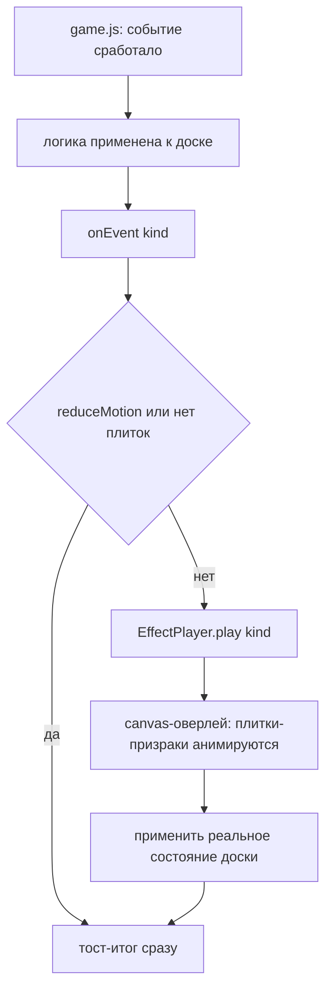

# Зрелищность существующих событий и механик — дизайн-план

> Продолжение подхода «Акулы»: **улучшить графику и зрелищность уже существующих**
> случайных событий и механик (не добавлять новые элементы). Каждое событие получает
> богатую кинематографичную подачу (не эмодзи), согласованную с темами и «живым океаном».
> Документ — предложение идей по каждому элементу; реализация отдельными шагами.

## Цель и границы

Проработать **только существующие** случайные события и механики так же глубоко, как
темы и акулу. **Новые элементы/механики не добавляем** — только визуальный апгрейд
того, что уже есть.

Охват:
- Случайные события: 🌪️ Шторм, 🪼 Медузий дождь, 🫧 Пузырь.
- Механики: 🌊 Прилив/Отлив, 🌀 Водоворот (угроза).
- 🦈 Акула — уже сделана (части A и B), служит образцом стиля.

Вне охвата (не делаем сейчас): новые эффекты-катастрофы (молния, тайфун, вулкан,
заморозка, туман) — это добавление новых элементов, отложено.

## Ключевые архитектурные факты (проверено)

### Слои (z-index) в [`css/styles.css`](d:/Рабочая/pirat/css/styles.css)
| Слой | z-index | Назначение |
|------|---------|-----------|
| `.atmosphere-layer` (canvas) | 0 | фон «живого океана», за всем UI |
| `.container` (доска) | 2 | доска и элементы |
| `.autumn-layer` (canvas) | 60 | осенние листья поверх UI |
| `.shark-attack-layer` | 5000 | киношный оверлей атаки (паттерн для эффектов) |
| `.modal-overlay` | ~9000 | модалки |
| `.confetti-layer` | 10000 | конфетти |

### Движок случайных событий в [`game.js`](d:/Рабочая/pirat/js/game.js)
- `_normalizeEvents(cfg)` (стр. 1086): `interval` + `weights {storm, jelly, bubble}`.
- `_triggerRandomEvent()` (стр. 1122): выбор по весам через инжектируемый RNG.
- `_eventStorm()` (стр. 1134): перемешивает плитки → `onEvent({kind:'storm'})`.
- `_eventJelly()` (стр. 1155): добавляет плитки → `onEvent({kind:'jelly', count, value})`.
- `_eventBubble()` (стр. 1175): ×2 плитки → `onEvent({kind:'bubble', idx, value})`.
- Механики: `_triggerEbbtide()` (прилив/отлив, меняет значения), `movesPenalty`
  (водоворот — смывает плитки при бесполезных ходах).

### Пульс-система и UI
- `gamePulse(kind)` / `atmospherePulse(kind)` → `ocean.setPulse(kind)` — реакция фона.
- Индикаторы: `tideIndicator` (прилив), `threatIndicator` (водоворот), `sharkIndicator`.
- `showToast(msg, icon)` — всплывающие уведомления.
- `reduce-motion`: `body.reduce-motion` скрывает атмосферу; киношные оверлеи должны
  пропускаться (событие применяется мгновенно, без анимации).

### Паттерн «киношного оверлея» (из акулы, часть B)
- Полноэкранный fixed-оверлей `z-index: 5000`, `pointer-events: none`, создаётся из JS.
- Внутри `<canvas>` на весь экран (DPR-масштаб) + вспомогательные div (вспышка/виньетка).
- Снять геометрию плиток (bounding rect), скрыть реальные плитки (`opacity:0`),
  рисовать «призраки» на canvas, затем вернуть/применить результат.
- Таймлайн фаз через `requestAnimationFrame`; по завершении — `done()`.

---

## Часть 1 — Общий фреймворк «зрелищных событий»

Чтобы не плодить отдельные оверлеи, ввести **единый движок визуализации событий**,
который переиспользует canvas-оверлей акулы. Это ключевое архитектурное решение.

### Новый модуль [`js/effects.js`](d:/Рабочая/pirat/js/effects.js) (чистые функции + класс)

```js
// Реестр визуализаторов: имя → { draw(ctx, t, state), duration }
export const EFFECTS = {
  storm:   { duration: 1.4, draw: drawStorm },
  jelly:   { duration: 1.2, draw: drawJelly },
  bubble:  { duration: 1.0, draw: drawBubble },
  tide:    { duration: 1.5, draw: drawTide },
  whirlpool:{ duration: 1.6, draw: drawWhirlpool },
};

// Класс-движок: один canvas-оверлей, запускает визуализатор по имени.
export class EffectPlayer {
  constructor(layer, ctx, { reduceMotion }) { ... }
  play(name, boardEl, done) { ... }   // снимает плитки, гонит таймлайн, зовёт done
}
```

### Единая точка входа в [`js/main.js`](d:/Рабочая/pirat/js/main.js)
- Создать один `effectLayer` (fixed, z-index 5000) рядом с `sharkAttackLayer`.
- Функция `playEffect(name, done)`:
  - `if (reduceMotion) { done(); return; }`
  - если доска пуста/нет плиток — `done()` сразу;
  - иначе `effectPlayer.play(name, boardEl, done)`.
- В обработчике `onEvent({kind})` вместо мгновенного показа эмодзи-баннера:
  ```js
  onEvent: (e) => {
    playEffect(e.kind, () => { /* показать тост-итог события */ });
  }
  ```
  Важно: событие уже применило логику в game.js (плитки перемешаны/добавлены/×2).
  Оверлей лишь **визуализирует** уже произошедшее изменение (плитки «летят» в новое
  положение), поэтому блокировать ввод не нужно — эффект идёт поверх, плитки
  анимируются из старой позиции в новую.

### Принципы отрисовки (общие для всех)
1. **Не эмодзи** — процедурная графика через `ctx` (как силуэт акулы).
2. **Согласованность с темой** — цвета эффекта берутся из активной темы/палитры
   (гроза в abyss — холоднее, в sunset — теплее).
3. **Плитки как «призраки»** — снять DOM-плитки, анимировать их на canvas
   (перемещение/исчезновение/вспышка), затем применить реальное состояние.
4. **reduce-motion** — мгновенно, без оверлея.
5. **Не мешать геймплею** — `pointer-events: none`, короткая длительность (1–1.5 c).

### Диаграмма потока



---

## Часть 2 — Существующие события (визуальный апгрейд)

### 🌪️ Шторм (перемешивание плиток) — «Ураганный вихрь»
**Сейчас:** плитки просто меняются местами, показывается эмодзи 🌪️.
**Предложение:** полноэкранный вихрь.
- Фазы (~1.4 c): затемнение краёв → в центре доски закручивается воронка из
  спиральных линий/брызг → плитки-призраки по спирали «слетаются» к центру и
  разлетаются в новые позиции → вихрь рассеивается.
- Отрисовка: спираль Архимеда (полупрозрачные дуги), частицы-брызги, лёгкая тряска
  доски (`shake`).
- Итог: плитки оказываются на новых местах — совпадает с реальным перемешиванием.

### 🪼 Медузий дождь (добавление плиток) — «Рой медуз»
**Сейчас:** добавляются плитки, эмодзи 🪼.
**Предложение:** сверху «падают» полупрозрачные медузы (купол + щупальца, процедурно),
каждая приземляется на пустую клетку и превращается в новую плитку-обитателя.
- Фазы (~1.2 c): небо темнеет → медузы-призраки опускаются на пустые клетки →
  вспышка-«всплытие» новой плитки (`tileAppear`).
- Отрисовка: купол-полусфера с градиентом, волнистые щупальца (синусоида), мягкое
  свечение (под цвет темы).

### 🫧 Пузырь (×2 плитки) — «Пузырь удачи»
**Сейчас:** случайная плитка удваивается, эмодзи 🫧.
**Предложение:** вокруг выбранной плитки появляется растущий мыльный пузырь с
радужным переливом; плитка внутри «надувается» (значение ×2), пузырь лопается с
брызгами.
- Фазы (~1.0 c): пузырь растёт вокруг плитки → цифра/обитатель меняется на ×2 →
  лопание (кольцо + капли).
- Отрисовка: окружность с градиентной обводкой (радужные блики), блик-«зайчик».

---

## Часть 3 — Существующие механики (визуальный апгрейд)

### 🌊 Прилив/Отлив (меняет значения плиток)
**Сейчас:** индикатор-полоса + плитки меняют значения.
**Предложение:** «волна» прокатывается по доске сверху вниз (прилив) или снизу вверх
(отлив).
- Фазы (~1.5 c): полупрозрачный гребень-волна (синусоида с пеной) проходит по рядам →
  затронутые плитки «смываются» и всплывают с новым значением → лёгкий блик воды.
- Отрисовка: движущаяся полоса градиента воды с белой пеной по кромке, капли.
- Согласуется с `flashTideSweep()` и индикатором.

### 🌀 Водоворот (угроза при бесполезных ходах)
**Сейчас:** индикатор-полоса + плитки смываются.
**Предложение:** в центре доски формируется воронка-водоворот, которая затягивает
плитки по спирали вниз (они исчезают).
- Фазы (~1.6 c): нарастающее вращение воронки (концентрические эллипсы, сужающиеся
  к центру) → плитки-призраки по спирали уходят в центр и гаснут → воронка схлопывается.
- Отрисовка: вращающиеся эллипсы с градиентом глубины, брызги по краям.
- Согласуется с `flashThreatSweep()` и индикатором.

---

## Часть 4 — Точки правок (сводка)

| Файл | Что |
|------|-----|
| [`js/effects.js`](d:/Рабочая/pirat/js/effects.js) | **новый** — реестр `EFFECTS`, класс `EffectPlayer`, чистые функции отрисовки каждого эффекта |
| [`js/main.js`](d:/Рабочая/pirat/js/main.js) | создать `effectLayer`; `playEffect(name, done)`; подключить в `onEvent`; согласовать с индикаторами |
| [`js/atmosphere.js`](d:/Рабочая/pirat/js/atmosphere.js) | новые `setPulse`-реакции (шторм/прилив/водоворот) для фона |
| [`css/styles.css`](d:/Рабочая/pirat/css/styles.css) | стили `effectLayer` (переиспользовать `.shark-attack-layer`), вспышки, `reduce-motion` |
| [`js/effects.test.js`](d:/Рабочая/pirat/js/effects.test.js) | тесты чистых функций отрисовки/конфигов |

> game.js **не меняется** — логика событий уже есть; добавляется только визуализация.

---

## Тестирование

1. `npm test` — все тесты зелёные (существующие + новые на чистые функции отрисовки).
2. `npx eslint js` — чисто.
3. Эмпирически (headless Edge, с/без `prefers-reduced-motion`):
   - каждое событие запускается и корректно визуализируется;
   - плитки после эффекта совпадают с реальным состоянием доски;
   - reduce-motion: эффект мгновенный, без оверлея;
   - эффекты не блокируют ввод и не конфликтуют с акулой/модалками.

---

## Предлагаемый порядок реализации (этапы)

1. **Фреймворк** — `effects.js` (EffectPlayer + effectLayer в main.js) на примере
   «Шторма» (самое простое, логика перемешивания уже есть).
2. **Существующие события** — Шторм → Медузий дождь → Пузырь.
3. **Существующие механики** — Прилив/Отлив → Водоворот.
4. **Полировка** — согласование с темами, индикаторами, звуком, reduce-motion.
